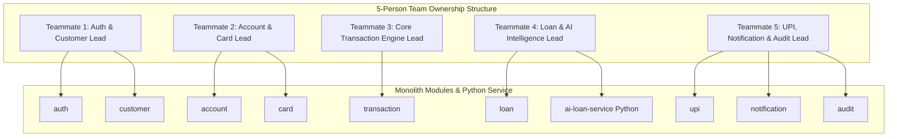

# 03. Service Boundaries & Team Ownership Specification

## 1. Modular Monolith Architecture Strategy

The **NextGen Digital Banking Platform (v1)** is implemented as a **Modular Monolith** in Java + Spring Boot, paired with a single external microservice (**AI Loan Intelligence Service**) written in Python (FastAPI).

### Key Architectural Rationale:
* **Single Codebase & Deployment Unit**: Simplifies CI/CD, testing, database transactions, and operational monitoring for a 5-person development team.
* **Strict Encapsulation**: Each domain module resides in its own isolated Java package (`com.nextgen.bank.<module>`). Cross-module access is permitted **only** via public Interface Services and DTOs. Direct instantiation or import of internal entity classes across package boundaries is strictly prohibited.
* **Single PostgreSQL Database with Logical Schema Isolation**: All modules share one PostgreSQL instance, but tables are prefixed by domain name (e.g., `auth_users`, `customer_profiles`, `account_details`, `txn_transactions`).
* **Standalone AI Microservice Exception**: The AI Loan Intelligence logic is hosted as a dedicated Python FastAPI service to leverage Python's machine learning ecosystem (`pandas`, `scikit-learn`, `numpy`).

---

## 2. Module Boundaries & Data Ownership

| Module Name | Package Location | Primary Responsibilities | Tables Owned | Exposes Interface |
| :--- | :--- | :--- | :--- | :--- |
| **Identity & Access (`auth`)** | `com.nextgen.bank.auth` | Registration, login, JWT validation, RBAC enforcement, password management. | `auth_users`, `auth_user_sessions` | `AuthService` |
| **Customer Management (`customer`)** | `com.nextgen.bank.customer` | Profiles, KYC document verification, addresses, nominee management. | `cust_profiles`, `cust_addresses`, `cust_kyc_docs`, `cust_nominees` | `CustomerService` |
| **Account Management (`account`)** | `com.nextgen.bank.account` | Account lifecycle, balance queries, hold management, freeze/closure. | `acc_accounts`, `acc_holds` | `AccountService` |
| **Transaction Engine (`transaction`)** | `com.nextgen.bank.transaction` | Deposits, withdrawals, internal transfers, daily limits, beneficiary management. | `txn_transactions`, `txn_beneficiaries` | `TransactionService` |
| **UPI & QR Payments (`upi`)** | `com.nextgen.bank.upi` | VPA management, QR code generation/parsing, UPI PIN validation, UPI transfers. | `upi_profiles`, `upi_qr_codes` | `UPIService` |
| **Loan Management (`loan`)** | `com.nextgen.bank.loan` | Applications, EMI calculations, approval workflows, repayment tracking. | `loan_applications`, `loan_accounts`, `loan_emi_schedules` | `LoanService` |
| **AI Loan Intelligence (`ai-loan-service`)** | *Standalone Python Repo/Service* | Rule-based and ML credit risk evaluation, scoring, repayment probability. | *Stateless (Uses rule matrix & ML model weights)* | `POST /api/v1/ai/evaluate-risk` |
| **Card Management (`card`)** | `com.nextgen.bank.card` | Debit/credit card issuance, status toggling, PIN management, card limits. | `card_cards` | `CardService` |
| **Notifications (`notification`)** | `com.nextgen.bank.notification` | Email/SMS/in-app dispatching, template management, notification logs. | `notif_notifications` | `NotificationService` |
| **Audit & Compliance (`audit`)** | `com.nextgen.bank.audit` | Immutable audit log records for user, staff, and system actions. | `audit_logs` | `AuditService` |

---

## 3. Communication Patterns

### 3.1. Synchronous Internal Calls (Spring Beans)
When one module requires synchronous data verification from another within the monolith, it calls the target module's **Service Interface** using lightweight DTOs:

* **Example 1**: `TransactionModule` → `AccountService.getAccountDetails(accountId)` to verify active status and balance before debiting.
* **Example 2**: `AccountModule` → `CustomerService.getKYCStatus(customerId)` to verify KYC before opening an account.

### 3.2. Synchronous External REST Call (Java Loan Module → Python AI Service)
The `loan` module communicates with the standalone `ai-loan-service` via a HTTP client (`RestClient` or `WebClient`):

```
+---------------------------+   HTTP POST /api/v1/ai/evaluate-risk   +--------------------------------+
|  LoanModule (Java Monolith)| -------------------------------------> | AI Loan Service (Python/FastAPI)|
|                           | <------------------------------------- |                                |
+---------------------------+        CreditRiskEvaluationResult       +--------------------------------+
```

### 3.3. Asynchronous In-Memory Event Bus (Spring ApplicationEventPublisher)
Decoupled actions (notifications, audit logging) use Spring domain events:

```
[ Domain Action ] 
       │
       ▼
 [ Publish DomainEvent ] ───► [ Spring ApplicationEventPublisher ]
                                           │
                        ┌──────────────────┴──────────────────┐
                        ▼                                     ▼
            [ NotificationEventListener ]            [ AuditEventListener ]
            (@Async, AFTER_COMMIT)                   (@Async, AFTER_COMMIT)
```

---

## 4. Team Ownership & Work Distribution (5 Developers)

To ensure clear ownership, prevent code collisions, and simplify code reviews, the system modules and external service are assigned across 5 team members as follows:



### Responsibility Breakdown & Workload Rebalancing Rationale:

1. **Teammate 1 (Identity & Customer Lead)**
   * Modules: `auth`, `customer`
   * Key Deliverables: JWT authentication, Spring Security configuration, RBAC filters, KYC upload & verification flows, Customer profile & nominee management.

2. **Teammate 2 (Account & Card Lead)**
   * Modules: `account`, `card`
   * Key Deliverables: Savings/Current account management, balance hold mechanisms, debit/credit card issuance, PIN hashing, card block/unblock logic.

3. **Teammate 3 (Core Transaction Engine Lead)**
   * Modules: `transaction` (Dedicated Focus)
   * Key Deliverables: High-concurrency double-entry ledger processing, atomic debit/credit operations, row-level locking (`SELECT ... FOR UPDATE`), daily transfer limit validations, duplicate transaction detection, beneficiary cooling-off rules, and transactional outbox persistence.
   * **Rebalancing Rationale**: The Transaction Engine is the most critical and complex core component of a banking system. Dedicated 100% ownership allows Teammate 3 to focus exclusively on concurrency safety, idempotency, performance, and financial data integrity without being burdened by UPI domain logic.

4. **Teammate 4 (Loan & AI Intelligence Lead)**
   * Modules: `loan`, `ai-loan-service` (Python)
   * Key Deliverables: Loan application workflow, reducing-balance EMI schedule math, Python FastAPI service development (weighted rule-scoring engine), Spring-to-Python REST integration, loan disbursement logic.

5. **Teammate 5 (UPI Payments, Notifications & Audit Lead)**
   * Modules: `upi`, `notification`, `audit`
   * Key Deliverables: VPA (Virtual Payment Address) creation and validation, EMVCo QR payload generation/parsing, UPI PIN BCrypt hashing, centralized async event listeners (`@TransactionalEventListener`), notification dispatchers, immutable audit log aspect.
   * **Rebalancing Rationale**: Notifications (`notification`) and Auditing (`audit`) are lightweight, reactive listener modules. Pairing `upi` with `notification` and `audit` creates a well-rounded "Integrations, Gateway Payments & Operations" domain for Teammate 5, ensuring equal complexity and workload distribution across all 5 team members.

