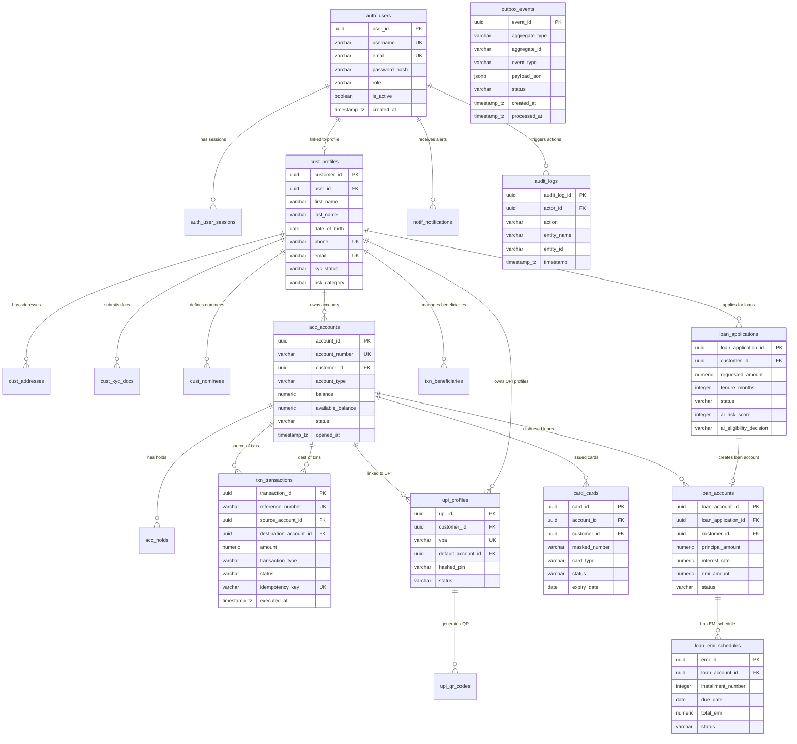

# 04. Database ERD & Schema Specification

## 1. Overview & Database Architecture

The **NextGen Digital Banking Platform** relies on a single **PostgreSQL** relational database. Data integrity, foreign key constraints, indexes, and ACID compliance are enforced at the database level.

### Key Database Conventions:
* **Table Naming**: Prefixed by module name to ensure logical separation (`auth_`, `cust_`, `acc_`, `txn_`, `upi_`, `loan_`, `card_`, `notif_`, `audit_`).
* **Primary Keys**: UUID v4 across all tables (`UUID` type in PostgreSQL).
* **Timestamps**: All timestamps stored in UTC (`TIMESTAMP WITH TIME ZONE`).
* **Financial Precision**: Money amounts stored as `NUMERIC(15, 2)` (never float/double). Rates/percentages stored as `NUMERIC(5, 4)` or `NUMERIC(5, 2)`.

---

## 2. Master Entity-Relationship Diagram (Mermaid ERD)

---

## 3. Data Dictionary & Detailed Table Definitions

### 3.1. Identity Module (`auth`)

#### Table: `auth_users`
| Column Name | Data Type | Constraints | Description |
| :--- | :--- | :--- | :--- |
| `user_id` | `UUID` | `PRIMARY KEY, DEFAULT gen_random_uuid()` | Unique user identifier |
| `username` | `VARCHAR(50)` | `NOT NULL, UNIQUE` | User login handle |
| `email` | `VARCHAR(100)` | `NOT NULL, UNIQUE` | User email address |
| `password_hash` | `VARCHAR(255)` | `NOT NULL` | BCrypt password hash |
| `role` | `VARCHAR(20)` | `NOT NULL` | `CUSTOMER`, `BANK_STAFF`, `ADMIN`, `AUDITOR` |
| `is_active` | `BOOLEAN` | `NOT NULL, DEFAULT true` | Account active toggle |
| `failed_login_attempts`| `INTEGER` | `NOT NULL, DEFAULT 0` | Counter for lockout |
| `lockout_until` | `TIMESTAMPTZ` | `NULL` | Lockout expiration timestamp |
| `created_at` | `TIMESTAMPTZ` | `NOT NULL, DEFAULT CURRENT_TIMESTAMP`| Record creation timestamp |
| `updated_at` | `TIMESTAMPTZ` | `NOT NULL, DEFAULT CURRENT_TIMESTAMP`| Record update timestamp |

* **Indexes**:
  * `idx_auth_users_email` ON `email`
  * `idx_auth_users_username` ON `username`

#### Table: `auth_user_sessions`
| Column Name | Data Type | Constraints | Description |
| :--- | :--- | :--- | :--- |
| `session_id` | `UUID` | `PRIMARY KEY, DEFAULT gen_random_uuid()` | Session identifier |
| `user_id` | `UUID` | `NOT NULL, REFERENCES auth_users(user_id)`| Linked user FK |
| `refresh_token_hash` | `VARCHAR(255)` | `NOT NULL` | SHA-256 hash of refresh token |
| `ip_address` | `VARCHAR(45)` | `NOT NULL` | Client IP address |
| `user_agent` | `VARCHAR(255)` | `NOT NULL` | Client browser/device agent |
| `expires_at` | `TIMESTAMPTZ` | `NOT NULL` | Session expiry |
| `is_revoked` | `BOOLEAN` | `NOT NULL, DEFAULT false` | Revocation status |

---

### 3.2. Customer Module (`customer`)

#### Table: `cust_profiles`
| Column Name | Data Type | Constraints | Description |
| :--- | :--- | :--- | :--- |
| `customer_id` | `UUID` | `PRIMARY KEY, DEFAULT gen_random_uuid()` | Unique customer ID |
| `user_id` | `UUID` | `NOT NULL, UNIQUE, REFERENCES auth_users(user_id)`| Linked user ID |
| `first_name` | `VARCHAR(50)` | `NOT NULL` | First name |
| `last_name` | `VARCHAR(50)` | `NOT NULL` | Last name |
| `date_of_birth` | `DATE` | `NOT NULL` | Date of birth |
| `phone` | `VARCHAR(15)` | `NOT NULL, UNIQUE` | Primary mobile number |
| `email` | `VARCHAR(100)` | `NOT NULL, UNIQUE` | Primary email |
| `kyc_status` | `VARCHAR(20)` | `NOT NULL, DEFAULT 'PENDING'` | `PENDING`, `VERIFIED`, `REJECTED` |
| `risk_category` | `VARCHAR(20)` | `NOT NULL, DEFAULT 'MEDIUM'` | `LOW`, `MEDIUM`, `HIGH` |
| `created_at` | `TIMESTAMPTZ` | `NOT NULL, DEFAULT CURRENT_TIMESTAMP`| Registration time |

#### Table: `cust_kyc_docs`
| Column Name | Data Type | Constraints | Description |
| :--- | :--- | :--- | :--- |
| `document_id` | `UUID` | `PRIMARY KEY, DEFAULT gen_random_uuid()` | Document ID |
| `customer_id` | `UUID` | `NOT NULL, REFERENCES cust_profiles(customer_id)`| Linked Customer FK |
| `document_type` | `VARCHAR(20)` | `NOT NULL` | `PAN`, `AADHAAR`, `PASSPORT` |
| `document_number_enc`| `VARCHAR(255)` | `NOT NULL` | AES-256 encrypted document number |
| `file_reference` | `VARCHAR(255)` | `NOT NULL` | Storage URI reference |
| `verification_status`| `VARCHAR(20)` | `NOT NULL, DEFAULT 'PENDING'` | `PENDING`, `APPROVED`, `REJECTED` |
| `verified_by` | `UUID` | `NULL, REFERENCES auth_users(user_id)`| Staff User ID |
| `verified_at` | `TIMESTAMPTZ` | `NULL` | Verification timestamp |

---

### 3.3. Account Module (`account`)

#### Table: `acc_accounts`
| Column Name | Data Type | Constraints | Description |
| :--- | :--- | :--- | :--- |
| `account_id` | `UUID` | `PRIMARY KEY, DEFAULT gen_random_uuid()` | Account identifier |
| `account_number` | `VARCHAR(12)` | `NOT NULL, UNIQUE` | 12-digit account number |
| `customer_id` | `UUID` | `NOT NULL, REFERENCES cust_profiles(customer_id)`| Account owner FK |
| `account_type` | `VARCHAR(20)` | `NOT NULL` | `SAVINGS`, `CURRENT` |
| `balance` | `NUMERIC(15,2)` | `NOT NULL, DEFAULT 0.00` | Ledger balance |
| `available_balance` | `NUMERIC(15,2)` | `NOT NULL, DEFAULT 0.00` | Balance after holds |
| `currency` | `VARCHAR(3)` | `NOT NULL, DEFAULT 'INR'` | ISO-4217 currency |
| `status` | `VARCHAR(20)` | `NOT NULL, DEFAULT 'PENDING_APPROVAL'`| `ACTIVE`, `FROZEN`, `CLOSED` |
| `freeze_reason` | `VARCHAR(255)` | `NULL` | Reason if frozen |
| `opened_at` | `TIMESTAMPTZ` | `NOT NULL, DEFAULT CURRENT_TIMESTAMP`| Account creation date |
| `closed_at` | `TIMESTAMPTZ` | `NULL` | Account closure date |

* **Indexes**:
  * `idx_acc_number` ON `account_number`
  * `idx_acc_customer` ON `customer_id`

---

### 3.4. Transaction Module (`transaction`)

#### Table: `txn_transactions`
| Column Name | Data Type | Constraints | Description |
| :--- | :--- | :--- | :--- |
| `transaction_id` | `UUID` | `PRIMARY KEY, DEFAULT gen_random_uuid()` | Transaction ID |
| `reference_number` | `VARCHAR(30)` | `NOT NULL, UNIQUE` | External bank reference |
| `source_account_id` | `UUID` | `NULL, REFERENCES acc_accounts(account_id)`| Source Account FK |
| `destination_account_id`|`UUID` | `NULL, REFERENCES acc_accounts(account_id)`| Destination Account FK |
| `amount` | `NUMERIC(15,2)` | `NOT NULL, CHECK (amount > 0)` | Transaction amount |
| `fee` | `NUMERIC(15,2)` | `NOT NULL, DEFAULT 0.00` | Transaction fee |
| `transaction_type` | `VARCHAR(30)` | `NOT NULL` | `INTERNAL_TRANSFER`, `UPI_TRANSFER`, `DEPOSIT`, `WITHDRAWAL` |
| `status` | `VARCHAR(20)` | `NOT NULL, DEFAULT 'INITIATED'`| `PROCESSING`, `COMPLETED`, `FAILED` |
| `idempotency_key` | `VARCHAR(100)` | `NOT NULL, UNIQUE` | Client idempotency key |
| `failure_reason` | `VARCHAR(255)` | `NULL` | Failure message |
| `narrative` | `VARCHAR(255)` | `NULL` | Statement line text |
| `executed_at` | `TIMESTAMPTZ` | `NOT NULL, DEFAULT CURRENT_TIMESTAMP`| Execution time |

* **Indexes**:
  * `idx_txn_ref_num` ON `reference_number`
  * `idx_txn_idempotency` ON `idempotency_key`
  * `idx_txn_src_acc` ON `source_account_id`
  * `idx_txn_dest_acc` ON `destination_account_id`

#### Table: `txn_beneficiaries`
| Column Name | Data Type | Constraints | Description |
| :--- | :--- | :--- | :--- |
| `beneficiary_id` | `UUID` | `PRIMARY KEY, DEFAULT gen_random_uuid()` | Beneficiary ID |
| `customer_id` | `UUID` | `NOT NULL, REFERENCES cust_profiles(customer_id)`| Customer FK |
| `beneficiary_name` | `VARCHAR(100)` | `NOT NULL` | Payee name |
| `account_number` | `VARCHAR(20)` | `NOT NULL` | Payee account number |
| `ifsc_code` | `VARCHAR(11)` | `NOT NULL` | Bank IFSC code |
| `max_transfer_limit`| `NUMERIC(15,2)` | `NOT NULL, DEFAULT 50000.00`| Custom limit |
| `status` | `VARCHAR(20)` | `NOT NULL, DEFAULT 'PENDING_COOLING_OFF'`| `ACTIVE`, `DELETED` |
| `added_at` | `TIMESTAMPTZ` | `NOT NULL, DEFAULT CURRENT_TIMESTAMP`| Timestamp added |

---

### 3.5. UPI Module (`upi`)

#### Table: `upi_profiles`
| Column Name | Data Type | Constraints | Description |
| :--- | :--- | :--- | :--- |
| `upi_id` | `UUID` | `PRIMARY KEY, DEFAULT gen_random_uuid()` | UPI profile ID |
| `customer_id` | `UUID` | `NOT NULL, REFERENCES cust_profiles(customer_id)`| Customer FK |
| `vpa` | `VARCHAR(100)` | `NOT NULL, UNIQUE` | Virtual Payment Address |
| `default_account_id`| `UUID` | `NOT NULL, REFERENCES acc_accounts(account_id)`| Linked Account FK |
| `hashed_pin` | `VARCHAR(255)` | `NOT NULL` | BCrypt encrypted UPI PIN |
| `status` | `VARCHAR(20)` | `NOT NULL, DEFAULT 'ACTIVE'` | `ACTIVE`, `SUSPENDED` |

---

### 3.6. Loan Module (`loan`)

#### Table: `loan_applications`
| Column Name | Data Type | Constraints | Description |
| :--- | :--- | :--- | :--- |
| `loan_application_id`| `UUID` | `PRIMARY KEY, DEFAULT gen_random_uuid()` | Application ID |
| `customer_id` | `UUID` | `NOT NULL, REFERENCES cust_profiles(customer_id)`| Applicant FK |
| `requested_amount` | `NUMERIC(15,2)` | `NOT NULL, CHECK (requested_amount > 0)` | Requested principal |
| `tenure_months` | `INTEGER` | `NOT NULL, CHECK (tenure_months > 0)` | Loan tenure |
| `loan_type` | `VARCHAR(20)` | `NOT NULL` | `PERSONAL`, `HOME`, `VEHICLE` |
| `monthly_income` | `NUMERIC(15,2)` | `NOT NULL` | Declared monthly income |
| `employment_type` | `VARCHAR(30)` | `NOT NULL` | `SALARIED`, `SELF_EMPLOYED` |
| `status` | `VARCHAR(30)` | `NOT NULL, DEFAULT 'SUBMITTED'` | `AI_EVALUATED`, `APPROVED`, `REJECTED` |
| `ai_risk_score` | `INTEGER` | `NULL` | Score calculated by AI Service |
| `ai_eligibility_decision`| `VARCHAR(30)`| `NULL` | AI recommendation |
| `ai_repayment_probability`| `NUMERIC(5,4)`| `NULL` | Probability (0.0000 - 1.0000) |
| `reviewed_by` | `UUID` | `NULL, REFERENCES auth_users(user_id)`| Staff FK |

#### Table: `loan_accounts`
| Column Name | Data Type | Constraints | Description |
| :--- | :--- | :--- | :--- |
| `loan_account_id` | `UUID` | `PRIMARY KEY, DEFAULT gen_random_uuid()` | Loan account ID |
| `loan_application_id`| `UUID` | `NOT NULL, UNIQUE, REFERENCES loan_applications(loan_application_id)` | Linked application FK |
| `customer_id` | `UUID` | `NOT NULL, REFERENCES cust_profiles(customer_id)`| Customer FK |
| `disbursed_account_id`| `UUID` | `NOT NULL, REFERENCES acc_accounts(account_id)`| Disbursement Account FK |
| `principal_amount` | `NUMERIC(15,2)` | `NOT NULL` | Sanctioned amount |
| `interest_rate` | `NUMERIC(5,2)` | `NOT NULL` | Annual interest rate % |
| `tenure_months` | `INTEGER` | `NOT NULL` | Tenure in months |
| `emi_amount` | `NUMERIC(15,2)` | `NOT NULL` | Monthly EMI amount |
| `outstanding_principal`|`NUMERIC(15,2)`| `NOT NULL` | Remaining principal balance |
| `status` | `VARCHAR(20)` | `NOT NULL, DEFAULT 'ACTIVE'` | `ACTIVE`, `DELINQUENT`, `CLOSED` |

#### Table: `loan_emi_schedules`
| Column Name | Data Type | Constraints | Description |
| :--- | :--- | :--- | :--- |
| `emi_id` | `UUID` | `PRIMARY KEY, DEFAULT gen_random_uuid()` | EMI record ID |
| `loan_account_id` | `UUID` | `NOT NULL, REFERENCES loan_accounts(loan_account_id)`| Linked Loan FK |
| `installment_number`| `INTEGER` | `NOT NULL` | 1..N installment number |
| `due_date` | `DATE` | `NOT NULL` | Payment due date |
| `principal_component`| `NUMERIC(15,2)`| `NOT NULL` | Principal portion of EMI |
| `interest_component` | `NUMERIC(15,2)`| `NOT NULL` | Interest portion of EMI |
| `total_emi` | `NUMERIC(15,2)`| `NOT NULL` | Total EMI amount |
| `status` | `VARCHAR(20)` | `NOT NULL, DEFAULT 'PENDING'` | `PENDING`, `PAID`, `OVERDUE` |

---

### 3.7. Card Module (`card`)

#### Table: `card_cards`
| Column Name | Data Type | Constraints | Description |
| :--- | :--- | :--- | :--- |
| `card_id` | `UUID` | `PRIMARY KEY, DEFAULT gen_random_uuid()` | Card ID |
| `account_id` | `UUID` | `NOT NULL, REFERENCES acc_accounts(account_id)`| Linked Account FK |
| `customer_id` | `UUID` | `NOT NULL, REFERENCES cust_profiles(customer_id)`| Cardholder FK |
| `masked_number` | `VARCHAR(19)` | `NOT NULL` | Masked card number |
| `card_type` | `VARCHAR(20)` | `NOT NULL` | `DEBIT`, `CREDIT` |
| `expiry_date` | `DATE` | `NOT NULL` | Expiry date |
| `cvv_hash` | `VARCHAR(255)` | `NOT NULL` | BCrypt hashed CVV |
| `status` | `VARCHAR(20)` | `NOT NULL, DEFAULT 'ACTIVE'` | `ACTIVE`, `BLOCKED`, `EXPIRED` |
| `block_reason` | `VARCHAR(50)` | `NULL` | Reason for block |
| `daily_pos_limit` | `NUMERIC(15,2)` | `NOT NULL, DEFAULT 50000.00` | POS transaction limit |
| `daily_atm_limit` | `NUMERIC(15,2)` | `NOT NULL, DEFAULT 25000.00` | ATM withdrawal limit |

---

### 3.8. Notification & Audit Modules (`notification`, `audit`)

#### Table: `notif_notifications`
| Column Name | Data Type | Constraints | Description |
| :--- | :--- | :--- | :--- |
| `notification_id` | `UUID` | `PRIMARY KEY, DEFAULT gen_random_uuid()` | Notification ID |
| `recipient_user_id` | `UUID` | `NOT NULL, REFERENCES auth_users(user_id)`| Recipient FK |
| `channel` | `VARCHAR(20)` | `NOT NULL` | `IN_APP`, `EMAIL`, `SMS` |
| `title` | `VARCHAR(150)` | `NOT NULL` | Header title |
| `body` | `TEXT` | `NOT NULL` | Message body |
| `status` | `VARCHAR(20)` | `NOT NULL, DEFAULT 'PENDING'` | `PENDING`, `SENT`, `FAILED` |
| `sent_at` | `TIMESTAMPTZ` | `NULL` | Delivery time |

#### Table: `audit_logs`
| Column Name | Data Type | Constraints | Description |
| :--- | :--- | :--- | :--- |
| `audit_log_id` | `UUID` | `PRIMARY KEY, DEFAULT gen_random_uuid()` | Audit entry ID |
| `actor_id` | `UUID` | `NULL, REFERENCES auth_users(user_id)`| Acting User FK |
| `actor_role` | `VARCHAR(30)` | `NOT NULL` | Role of actor |
| `action` | `VARCHAR(100)` | `NOT NULL` | Action code (e.g. `CARD_BLOCKED`) |
| `entity_name` | `VARCHAR(50)` | `NOT NULL` | Affected Entity |
| `entity_id` | `VARCHAR(100)` | `NOT NULL` | Primary Key of Entity |
| `old_value_json` | `JSONB` | `NULL` | Pre-change state |
| `new_value_json` | `JSONB` | `NULL` | Post-change state |
| `ip_address` | `VARCHAR(45)` | `NOT NULL` | Origin IP |
| `timestamp` | `TIMESTAMPTZ` | `NOT NULL, DEFAULT CURRENT_TIMESTAMP`| Execution time |

* **Indexes**:
  * `idx_audit_actor` ON `actor_id`
  * `idx_audit_action` ON `action`
  * `idx_audit_timestamp` ON `timestamp`

#### Table: `outbox_events` (Transactional Outbox Pattern)
| Column Name | Data Type | Constraints | Description |
| :--- | :--- | :--- | :--- |
| `event_id` | `UUID` | `PRIMARY KEY, DEFAULT gen_random_uuid()` | Event ID |
| `aggregate_type` | `VARCHAR(50)` | `NOT NULL` | Domain aggregate (e.g. `TRANSACTION`, `CUSTOMER`) |
| `aggregate_id` | `VARCHAR(100)` | `NOT NULL` | Entity ID |
| `event_type` | `VARCHAR(100)` | `NOT NULL` | Class name of event (e.g. `TransactionCompletedEvent`) |
| `payload_json` | `JSONB` | `NOT NULL` | Serialized event payload |
| `status` | `VARCHAR(20)` | `NOT NULL, DEFAULT 'PENDING'` | `PENDING`, `PROCESSED`, `FAILED` |
| `created_at` | `TIMESTAMPTZ` | `NOT NULL, DEFAULT CURRENT_TIMESTAMP` | Event persistence time |
| `processed_at` | `TIMESTAMPTZ` | `NULL` | Event dispatch time |
| `retry_count` | `INTEGER` | `NOT NULL, DEFAULT 0` | Retry counter |

* **Indexes**:
  * `idx_outbox_status_created` ON `(status, created_at)` WHERE status = 'PENDING'

