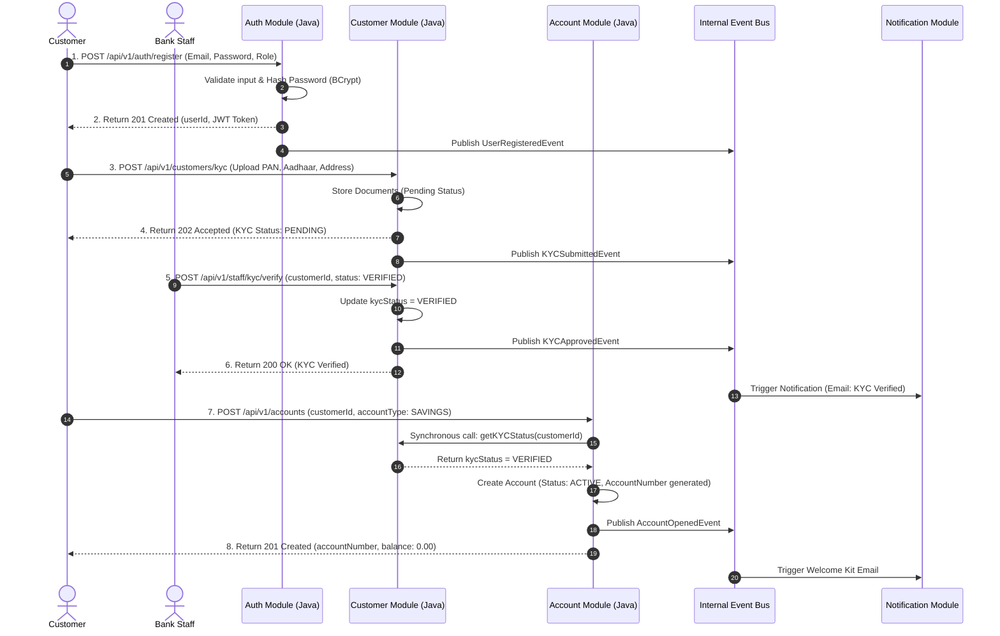
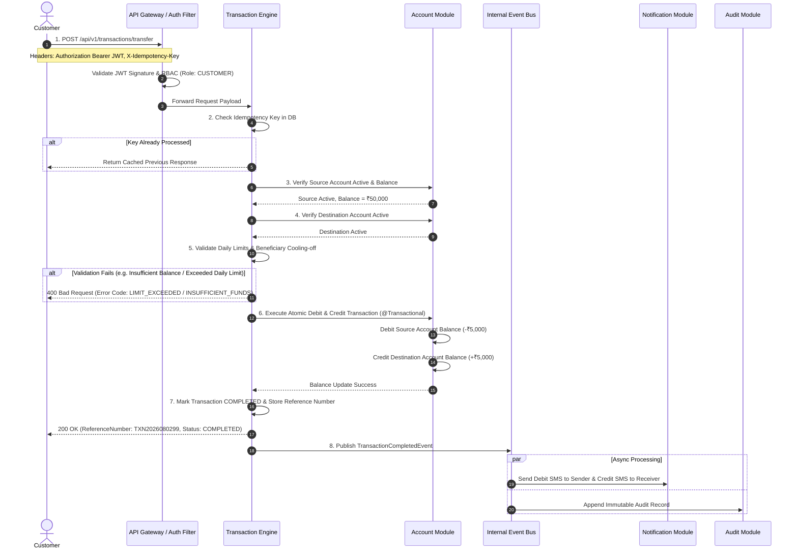
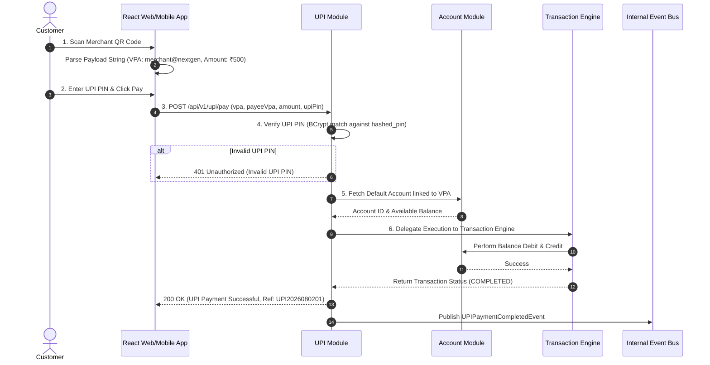
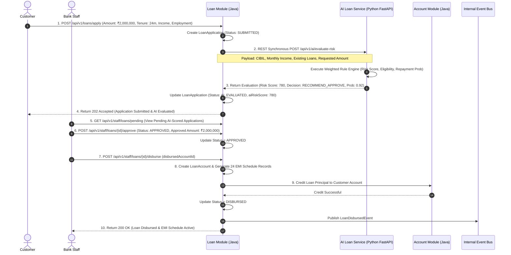
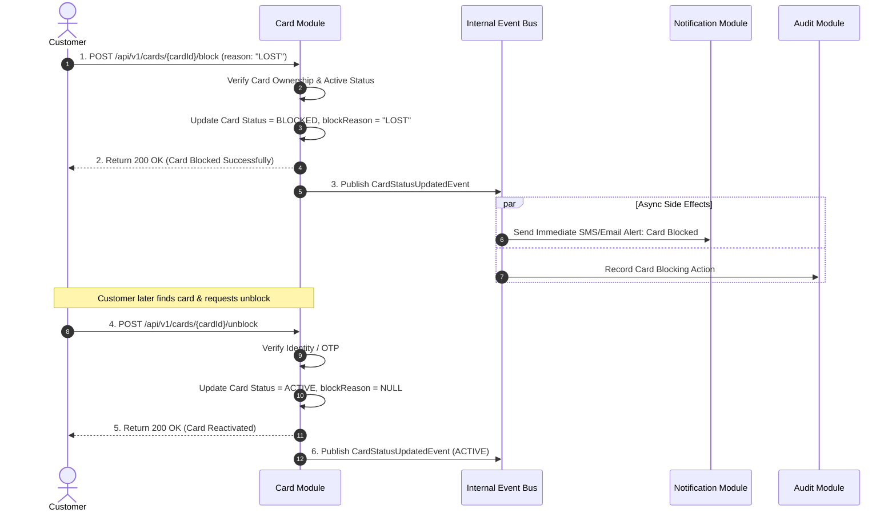

# 05. Sequence Diagrams Specification

## 1. Overview

This document presents end-to-end Mermaid sequence diagrams for critical business flows in the **NextGen Digital Banking Platform**. These diagrams illustrate interaction steps, authentication gates, cross-module communication, synchronous REST calls to the standalone Python AI service, and asynchronous domain events.

---

## 2. Customer Registration, KYC Verification & Account Opening Flow

---

## 3. Fund Transfer Flow (With Complete Validation Pipeline)

---

## 4. UPI & QR Code Payment Flow

---

## 5. End-to-End Loan Flow (Application → Python AI Scoring → Approval → Disbursement → EMI)

---

## 6. Card Block & Unblock Flow

