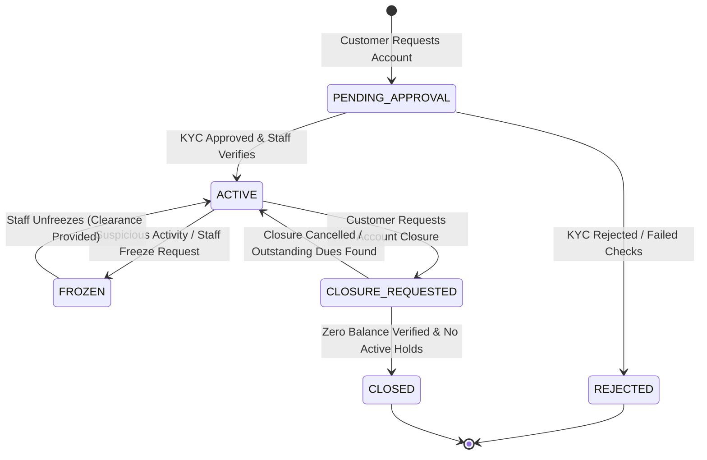
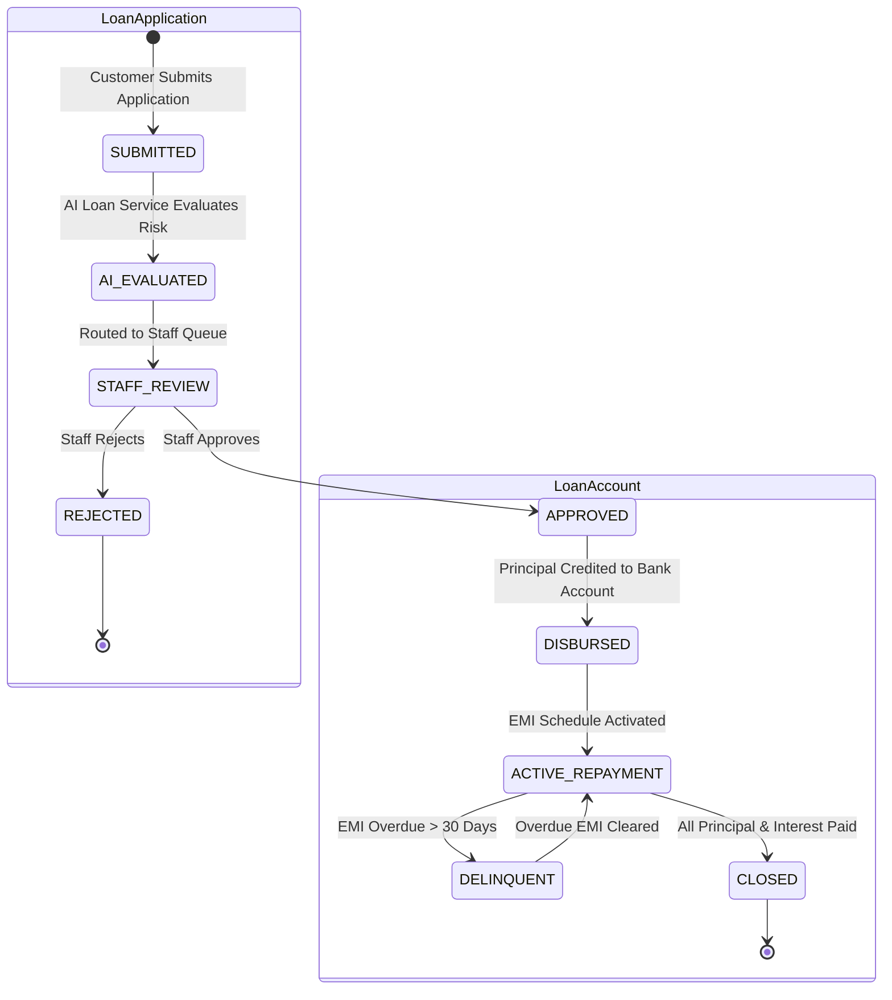
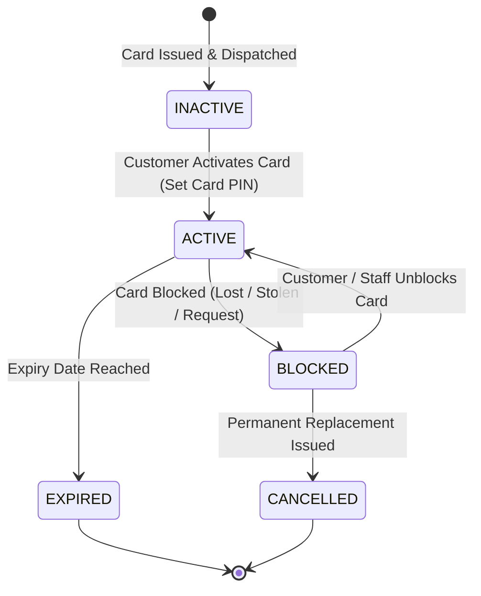
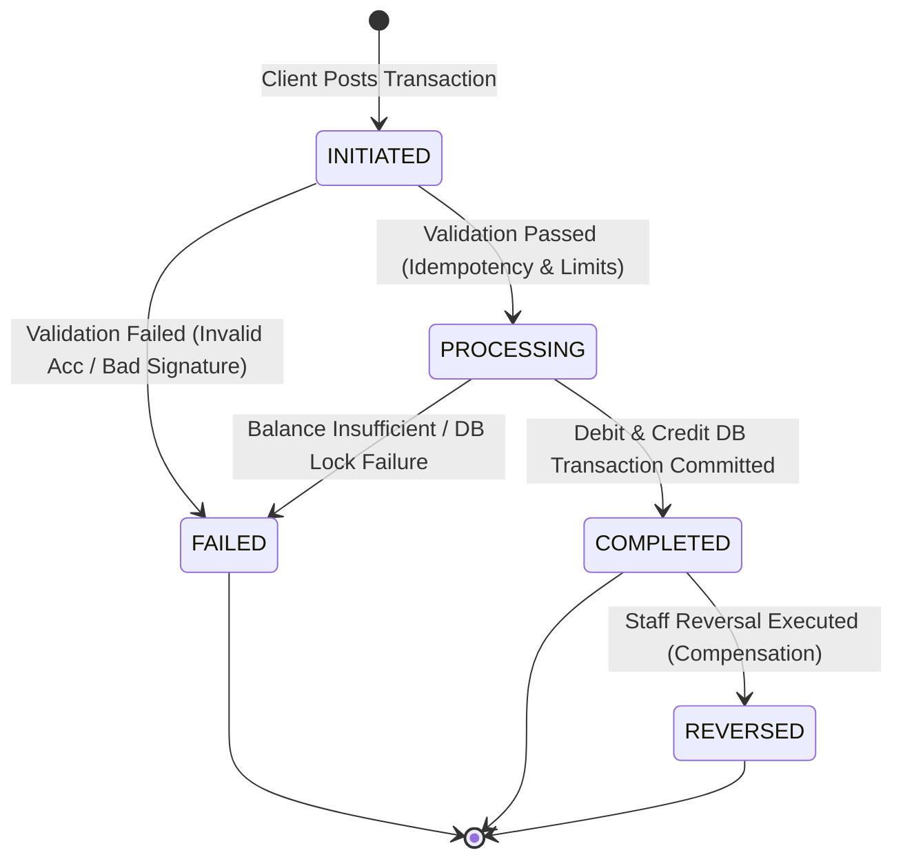

# 06. State Machines Specification

## 1. Overview

This document specifies the official state machines governing key business entities in the **NextGen Digital Banking Platform**:
1. **Account Lifecycle** (`acc_accounts`)
2. **Loan Lifecycle** (`loan_applications` & `loan_accounts`)
3. **Card Lifecycle** (`card_cards`)
4. **Transaction Lifecycle** (`txn_transactions`)

State transitions are strictly validated. Invalid state transitions throw a `DomainStateTransitionException` resulting in an HTTP `400 Bad Request` or `422 Unprocessable Entity`.

---

## 2. Account State Machine

An Account moves from initial creation through activation, operational holds, administrative freezes, and eventual permanent closure.

### Transition Matrix & Rules:

| Source State | Target State | Triggering Event / Action | Authorized Role | Invariants / Pre-conditions |
| :--- | :--- | :--- | :--- | :--- |
| `[START]` | `PENDING_APPROVAL` | Account opening request | `CUSTOMER` | User must have registered account. |
| `PENDING_APPROVAL` | `ACTIVE` | KYC verification completed | `BANK_STAFF` | Customer `kycStatus` MUST equal `VERIFIED`. |
| `PENDING_APPROVAL` | `REJECTED` | KYC rejected or check failure | `BANK_STAFF` / `SYSTEM` | Rejection reason documented. |
| `ACTIVE` | `FROZEN` | Freeze account command | `BANK_STAFF` / `SYSTEM` | Valid freeze reason required. |
| `FROZEN` | `ACTIVE` | Unfreeze account command | `BANK_STAFF` | Requires staff authorization and log. |
| `ACTIVE` | `CLOSURE_REQUESTED`| Customer requests closure | `CUSTOMER` | No active legal holds. |
| `CLOSURE_REQUESTED`| `CLOSED` | Final closure processing | `BANK_STAFF` / `SYSTEM` | Balance MUST be exactly 0.00; no open loans or active cards. |

---

## 3. Loan Application & Loan Account State Machine

Loans operate under a two-tier state model: **Loan Application** state followed by **Active Loan Account** state upon disbursement.

### Transition Rules:

| Entity | Source State | Target State | Trigger | Invariants / Rules |
| :--- | :--- | :--- | :--- | :--- |
| Application | `SUBMITTED` | `AI_EVALUATED` | REST call to `ai-loan-service` | Must populate `aiRiskScore` & `aiEligibilityDecision`. |
| Application | `AI_EVALUATED` | `STAFF_REVIEW` | System routing | Applications queued for staff review. |
| Application | `STAFF_REVIEW` | `APPROVED` | Staff decision | Sanctioned amount and rate defined. |
| Application | `STAFF_REVIEW` | `REJECTED` | Staff decision | Explicit rejection reason recorded. |
| Account | `APPROVED` | `DISBURSED` | Disbursement trigger | Funds transferred to customer savings/current account. |
| Account | `ACTIVE_REPAYMENT`| `DELINQUENT` | EMI Cron Job check | Triggered when an EMI remains unpaid > 30 days past due date. |
| Account | `ACTIVE_REPAYMENT`| `CLOSED` | Final EMI Payment | Outstanding balance reaches exactly 0.00. |

---

## 4. Card State Machine

Card states govern debit and credit card operations, handling temporary suspensions, blocks, and expiration.

### Transition Rules:

| Source State | Target State | Trigger | Pre-conditions |
| :--- | :--- | :--- | :--- |
| `INACTIVE` | `ACTIVE` | Customer activates via portal/OTP | Must verify CVV and set 4-digit PIN. |
| `ACTIVE` | `BLOCKED` | Customer or Staff block command | Block reason recorded (`LOST`, `STOLEN`, etc.). |
| `BLOCKED` | `ACTIVE` | Customer unblock request | Requires OTP / MFA verification. |
| `ACTIVE` | `EXPIRED` | System cron check on current date | Expiry date < Current date. |
| `BLOCKED` | `CANCELLED` | Customer requests card replacement | Old card cancelled permanently. |

---

## 5. Transaction State Machine

Transactions follow a strict state flow ensuring double-entry balance consistency and idempotency.

### Transition Rules:

| Source State | Target State | Trigger | Pre-conditions |
| :--- | :--- | :--- | :--- |
| `INITIATED` | `PROCESSING` | Idempotency & schema validation passed | Unique idempotency key acquired. |
| `INITIATED` | `FAILED` | Schema or signature invalid | Error message attached to record. |
| `PROCESSING` | `COMPLETED` | Spring `@Transactional` commit | Both debit and credit atomic operations succeed. |
| `PROCESSING` | `FAILED` | Exception or balance check failure | Transaction rolled back; balance untouched. |
| `COMPLETED` | `REVERSED` | Staff administrative compensation | Reversal transaction posted crediting source. |
