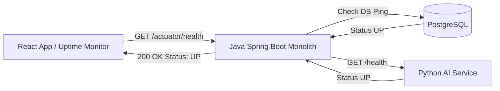

# 12. Testing Strategy & Observability Specification

## 1. Testing Strategy

The testing strategy ensures quality across unit, integration, and API layers tailored for a 5-person team environment.

```
       / \
      /   \      E2E / API Tests (Postman / RestAssured) - 15%
     /     \
    /-------\    Integration Tests (Testcontainers + SpringBootTest) - 35%
   /         \
  /-----------\  Unit Tests (JUnit 5 + Mockito / PyTest) - 50%
```

### 1.1. Testing Pyramid & Module Scope

| Level | Scope / Targets | Frameworks & Tools | Coverage Target |
| :--- | :--- | :--- | :---: |
| **Unit Testing** | Domain entities, service calculations (EMI math, Python rule score matrix, value object validators). | JUnit 5, Mockito, AssertJ, PyTest (Python) | $\ge 80\%$ |
| **Integration Testing** | Repository SQL queries, Spring Data JPA, database constraints, Spring Security filters, internal event listeners. | `@SpringBootTest`, Testcontainers (PostgreSQL), MockMvc | $\ge 70\%$ |
| **API / E2E Testing** | End-to-end HTTP REST flows (Registration $\rightarrow$ KYC $\rightarrow$ Account $\rightarrow$ Transfer $\rightarrow$ UPI $\rightarrow$ Loan). | RestAssured, Postman / Newman CLI | Key User Flows |

### 1.2. Module-Specific Test Scenarios

1. **`auth` Module**:
   * Unit test password hashing and strength validator.
   * Integration test JWT generation, validation, and token revocation.
2. **`customer` & `account` Modules**:
   * Test KYC gate invariant (attempt opening account for `PENDING` KYC customer $\rightarrow$ assert `422 UNPROCESSABLE_ENTITY`).
   * Test account freeze invariant (attempt debit from `FROZEN` account $\rightarrow$ assert `400 BAD_REQUEST`).
3. **`transaction` & `upi` Modules**:
   * Concurrent transfer test: 10 parallel threads debiting same account $\rightarrow$ assert balance non-negative and row locking prevents race conditions.
   * Idempotency test: Post transfer twice with same `X-Idempotency-Key` $\rightarrow$ assert transfer executed exactly once.
4. **`loan` & `ai-loan-service`**:
   * Unit test Python weighted rule calculator across all risk bands (`LOW`, `MEDIUM`, `HIGH`).
   * Integration test Java REST client fallback when Python service returns 500 or times out.

---

## 2. Observability & Monitoring Plan

Designed for a lightweight team setup using standard open-source tools without complex cloud infrastructure.

### 2.1. Correlation IDs & Structured Logging
* **MDC Correlation ID Filter**: A Spring Security servlet filter intercepts every incoming HTTP request and checks for `X-Correlation-ID` header. If absent, it generates `UUID.randomUUID()`.
* **MDC Injection**: Correlation ID and `userId` are injected into Logback SLF4J Mapped Diagnostic Context (MDC).
* **Structured JSON Logs**: Logs are emitted in JSON format containing:
  ```json
  {
    "timestamp": "2026-08-02T19:40:00.123Z",
    "level": "INFO",
    "correlationId": "corr_99998888-1111-4000-a000-000000000001",
    "userId": "usr_98765432-1111-4000-a000-000000000001",
    "logger": "com.nextgen.bank.transaction.service.TransactionServiceImpl",
    "message": "Fund transfer completed successfully",
    "referenceNumber": "TXN20260802998877",
    "amount": 5000.00
  }
  ```

### 2.2. Health & Metrics Endpoints
* **Spring Boot Actuator Endpoints**:
  * `/actuator/health`: Exposes database connection health, disk space, and custom Python AI service health indicator (`AIServiceHealthIndicator`).
  * `/actuator/metrics`: Exposes JVM heap memory, active HTTP requests, HikariCP connection pool metrics, and transaction latency counters (`http.server.requests`).
* **Python FastAPI Metrics**:
  * `/health`: Returns `{ "status": "UP", "service": "ai-loan-service", "modelVersion": "v1.0-rules" }`.

### 2.3. Health Check Flow Architecture


